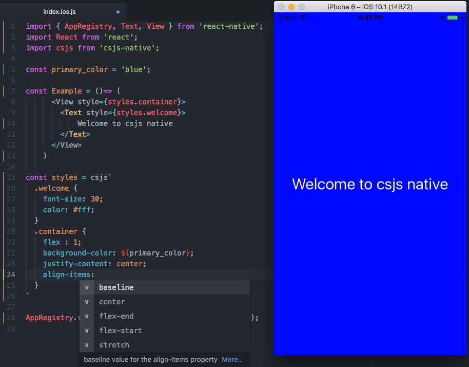

# csjs-native
Style React Native  using regular css, PostCss, SASS, LESS ...etc

csjs-native enables you to use the environment tools provided by [CSJS](https://github.com/rtsao/csjs) such as [PostCss babel plugin](https://github.com/rtsao/babel-plugin-csjs-postcss), Syntax highlighting and css auto complete.

##Features:
- Regular css (no object camel casing)
- Post css, SASS, LESS, CSSnext ...etc.
- Full power of js in css if you choose to.
- Syntax highlighting
- Css auto-complete
- Framework agnostic
- Share components across platform (Web, iOS, Android)
- Single file component if you choose to (js, jsx, css)
- Tiny  ~3KB


## Install
```javascript
//Still didn't publish to no npm, will do later
```

## Example

```javascript

import { AppRegistry, Text, View } from 'react-native';
import React from 'react';
import csjs from 'csjs-native';

const primary_color = 'blue';

const styles = csjs`
  .welcome {
    font-size: 30;
    color: #fff;
  }
  .container {
    flex : 1;
    background-color: ${primary_color};
    justify-content: center;
    align-items:
  }
`

const Example = ()=> (
      <View style={styles.container}>
        <Text style={styles.welcome}>
            Welcome to csjs native
        </Text>
      </View>
    )

AppRegistry.registerComponent('example', () => Example);

```


.


## Screenshot
This demonstrate syntax highlighting and auto complete



